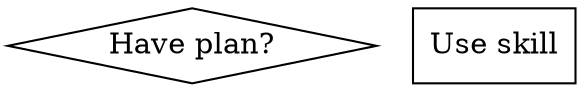

# Advanced Patterns & Anti-Patterns

## Table of Contents
1. [Advanced Patterns](#advanced-patterns)
2. [Anti-Patterns](#anti-patterns)
3. [Best Practices Consolidated](#best-practices)

---

## Advanced Patterns

### 1. Command-as-skill-wrapper

Separate entry point from logic. Command is just a thin wrapper that invokes a skill.

```markdown
---
description: "You MUST use this before any creative work..."
disable-model-invocation: true
---
Invoke the my-plugin:brainstorming skill and follow it exactly as presented
```

**Why it works**: `disable-model-invocation: true` prevents the model from responding directly. The command is just a routing layer — all logic lives in the skill. Clean separation of concerns.

Source: superpowers plugin

### 2. Confidence filtering (multi-model pipeline)

Use cheap models for filtering, expensive models for analysis:

1. **Haiku** for pre-filter (check eligibility)
2. **5x Sonnet** in parallel for specialized review
3. **Haiku** per issue for scoring (0-100)
4. Threshold: only issues with score >= 80 pass
5. **Haiku** final re-verification before commenting

Pattern: "cheap filter, expensive analysis".

Source: pr-review-toolkit plugin

### 3. SessionStart context injection

Inject structured context as system instruction at session start:

```json
{
  "hookSpecificOutput": {
    "hookEventName": "SessionStart",
    "additionalContext": "<EXTREMELY_IMPORTANT>Your context here</EXTREMELY_IMPORTANT>"
  }
}
```

The hook reads files via `${CLAUDE_PLUGIN_ROOT}` and injects them as additional context. The model receives this as system instruction.

Source: superpowers plugin, vercel plugin

### 4. Hooks as pipeline triggers

Hooks aren't just guardrails — they can start complete workflows:

- `Stop` hook with exit code 2 = conditional continuation (agent keeps running)
- Sub-agents invoked inside hooks
- Meta-agent pattern: agent supervising others via hooks

Source: claude-code-hooks-mastery

### 5. Hooks as observability layer

PostToolUse and Stop used for telemetry (tool calls, handoffs, lifecycle) — not flow control.

Source: claude-code-hooks-multi-agent-observability

### 6. Org-chart as agents

Map real organizational roles (CEO, EM, QA, Release Manager) to agents with defined scope and handoff protocol.

Source: gstack (37K stars)

### 7. Cross-tool portability (IR pattern)

Plugin as portable format — CLI converter automatically targets OpenCode, Codex, Copilot, Windsurf, Kiro, Gemini CLI, Qwen.

Source: compound-engineering-plugin (11K stars)

### 8. DOT graphs in SKILL.md

Replace descriptive text with formal decision graphs:



DOT diagrams replace prose for conditional logic.

Source: superpowers plugin

### 9. Anti-undertriggering keyword dictionary

Exhaustive list of natural language aliases in the description:

```yaml
description: >
  Activate when user mentions: chatbot GHL, SDR bot, bot de qualificacao,
  conversation AI, bot WhatsApp GHL, automacao de vendas...
```

Lists ALL the ways a user might ask for the same thing.

### 10. Core+Addon pattern (Cowork)

Split into mandatory core + optional add-ons:

```
financial-analysis/      # Core (required)
├── skills/ (41 skills)
├── commands/ (38 commands)
└── .mcp.json (11 integrations)

portfolio-analytics/     # Add-on (optional)
├── skills/
└── commands/
```

Source: anthropics/financial-services-plugins

### 11. PreToolUse input modification

Since v2.0.10, PreToolUse can not only block but also modify the tool's input before execution (transparent sandboxing).

Source: pixelmojo.io

---

## Anti-Patterns

### Structure

| Anti-pattern | Why it's bad | Fix |
|-------------|-------------|-----|
| Skills/commands inside `.claude-plugin/` | Not discovered — only manifests go there | Move to `skills/`, `commands/` at root |
| SKILL.md with 1000+ lines | Kills performance and context budget | Break into SKILL.md + `references/` |
| Chained references (A → B → C) | Model loses trail | Max 1 level of depth |
| Many options without default ("use X or Y or Z") | Model freezes | Always provide ONE default |
| Hardcoded paths (`/Users/...`) | Breaks on any other machine | Use `${CLAUDE_PLUGIN_ROOT}` |
| hooks.json referenced in plugin.json | "Duplicate hooks" error | Remove the reference (auto-discovered) |

### Descriptions

| Anti-pattern | Why it's bad | Fix |
|-------------|-------------|-----|
| Vague description ("Helps with documents") | Never activates — model needs specific triggers | Add "Use when..." with trigger phrases |
| First person ("I can help you...") | Wrong format | Third person: "Processes Excel files..." |
| Generic names (`helper`, `utils`, `tools`) | Doesn't differentiate | Descriptive: `meeting-notes-generator` |
| XML tags in description | Not supported | Plain text only |
| No trigger phrases | Undertriggers | List all ways users phrase the request |

### Plugins that age poorly

| Anti-pattern | Why it's bad | Fix |
|-------------|-------------|-----|
| Replicating native Claude Code features | SDK updates make it obsolete | Check if feature is already native |
| Overzealous skill without "what NOT to apply" boundaries | Worse than no skill — over-applies rules | Add explicit scope boundaries |
| Enforcing patterns in test files | Test patterns differ from production | Exclude test paths |
| Plugins with build steps | Non-dev users can't maintain | Pure Markdown + JSON only |

### Cowork-specific

| Anti-pattern | Why it's bad | Fix |
|-------------|-------------|-----|
| Depending on private APIs, Docker, git credentials | Sandbox blocks them | Use MCP servers + connectors |
| Build steps (npm install, pip install) | Cowork users can't run them | Pre-build everything |
| Technical language in user-facing text | Confuses non-dev users | Simple, capability-focused language |
| Mentioning `~~`, paths, schemas to users | Exposes implementation details | Frame as capabilities |

---

## Best Practices

### Design
1. **Start with minimum viable plugin** — one well-crafted skill > five half-baked ones
2. **Progressive disclosure** — core in SKILL.md, details in references/
3. **Combat undertriggering** — explicit descriptions with all scenarios
4. **Embed domain frameworks** — recognized frameworks (AIDA, MoSCoW, INVEST, etc.)
5. **Explicit anti-patterns** — tell the model what NOT to do
6. **Customization section** — allow adaptation per company/team

### Implementation
7. **Commands are for Claude** — directives, not documentation
8. **Imperative voice** — "Parse the file", not "You should parse the file"
9. **Portability** — `${CLAUDE_PLUGIN_ROOT}` everywhere
10. **Security** — env vars for credentials, HTTPS for remote
11. **Hooks > CLAUDE.md** for deterministic behaviors

### Communication (Cowork)
12. **Simple language** — Cowork users are non-technical
13. **Never expose implementation** — no paths, schemas, `~~`
14. **Frame in capabilities** — "This plugin lets you X" not "SKILL.md in skills/"

### Testing
15. **Full cycle** — uninstall → edit → install → restart → test
16. **Validate JSONs** — `jq .` on all JSON files
17. **Zero hardcoded paths** — `grep -r "/Users/" .`
18. **Correct permissions** — `chmod +x` on all scripts
19. **Use `--plugin-dir`** for fast local testing
20. **Use `/reload-plugins`** for hot-reload without restart

### Evaluation-driven development
21. **Create evals BEFORE writing skill** — minimum 3 per skill
22. **Benchmark against baseline** without the skill
23. **Test with multiple models** (Haiku, Sonnet, Opus)
24. **Cycle**: Claude A (writes skill) → Claude B (uses in real tasks) → observe → refine
